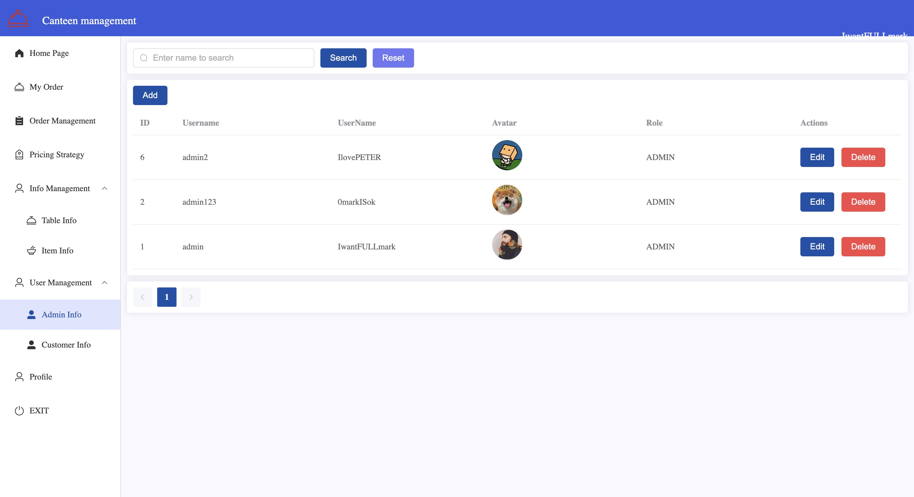

# Milestone 3 - Canteen Management System

## Project Group
**Group Number**: G10  
**Group Name**: 404 Not Founders

## Project Topic
**Online Ordering System**  
**Title**: *404: Hunger Not Found*


## Final Tech Stack

### Backend Technologies
- **Framework**: Spring Boot 3.2.0
- **Programming Language**: Java 21
- **Database**: MySQL 5.7
- **Connection Pool**: HikariCP
- **Build Tool**: Maven
- **Additional Libraries**:
  - Hutool (Utility library)
  - Lombok (Code generation)
  - PageHelper (Pagination)
  - WebSocket support for real-time communication

### Frontend Technologies
- **Framework**: Vue.js 3.3.4
- **Build Tool**: Vite 4.4.11
- **UI Library**: Element Plus 2.4.2
- **HTTP Client**: Axios 1.6.2
- **Routing**: Vue Router 4.2.5
- **WebSocket**: STOMP.js + SockJS for real-time updates

### Development Tools
- **Package Managers**: npm (frontend), Maven (backend)
- **CSS Preprocessor**: Sass
- **File Upload**: Multipart file handling

## Summarize the Functionalities Implemented

### Table Management System
- **Table Reservation**: Users can view and select available tables
- **Real-time Table Status**: Dynamic updates showing table availability (free/occupied)
- **Table State Management**: Automatic state transitions when users occupy or release tables

### Food Ordering System
- **Menu Display**: Visual food catalog with images, descriptions, and prices
- **Food Customization**: Decorator pattern implementation for adding extras (spicy, garlic, etc.)
- **Order Cart Management**: Add/remove items, modify quantities
- **Order Processing**: Complete order lifecycle from creation to completion

### Order Management
- **Order Tracking**: Real-time order status updates (Pending → Preparing → Completed/Cancelled)
- **Order History**: View past orders with detailed information
- **Admin Order Management**: Administrators can view and update all orders

### Pricing Strategy System
- **Dynamic Pricing**: Strategy pattern implementation for different pricing schemes
- **Discount Management**: Configurable discount rates and periods
- **Price Calculation**: Automatic application of decorators and discounts

### Real-time Communication
- **WebSocket Integration**: Live updates for order status changes
- **Admin Notifications**: Real-time alerts for new orders and status changes
- **User Notifications**: Order status updates delivered instantly

### File Management
- **Image Upload**: Support for food images and user avatars
- **File Storage**: Local file system with HTTP access endpoints

## Design Patterns Code (Add example code snippets)

### 1. Builder Pattern - Object Construction

**Builder Implementation:**
```java
// FoodsBuilder.java
public class FoodsBuilder {
    private Integer id;
    private String name;
    private BigDecimal price;
    private String descr;
    private String img;

    public FoodsBuilder id(Integer id) {
        this.id = id;
        return this;
    }

    public FoodsBuilder name(String name) {
        this.name = name;
        return this;
    }

    public FoodsBuilder price(BigDecimal price) {
        this.price = price;
        return this;
    }

    public Foods build() {
        Foods foods = new Foods(descr, price != null ? price.doubleValue() : 0.0);
        foods.setId(id);
        foods.setName(name);
        foods.setImg(img);
        return foods;
    }
}
```

### 2. Decorator Pattern - Food Customization

**Base Component and Decorators:**
```java
// FoodDecorator.java
public abstract class FoodDecorator implements FoodItem {
    private FoodItem foodItem;

    public FoodDecorator(FoodItem foodItem) {
        this.foodItem = foodItem;
    }

    @Override
    public String getDescription() {
        return foodItem.getDescription();
    }

    @Override
    public BigDecimal getPrice() {
        return foodItem.getPrice();
    }
}

// SpicyDecorator.java
public class SpicyDecorator extends FoodDecorator {
    public SpicyDecorator(FoodItem foodItem) {
        super(foodItem);
    }

    @Override
    public String getDescription() {
        return getFoodItem().getDescription() + " (Spicy)";
    }

    @Override
    public BigDecimal getPrice() {
        return getFoodItem().getPrice().add(Decorator.SPICY.getSurcharge());
    }
}
```

### 3. State Pattern - Order Status Management

**State Interface and Implementations:**
```java
// PendingState.java
public class PendingState extends OrderState {
    @Override
    public void confirmOrder(Orders order) {
        changeState(order, new PreparingState());
        System.out.println("Order " + order.getOrderNo() + " confirmed and sent to kitchen");
    }
    
    @Override
    public void cancelOrder(Orders order) {
        changeState(order, new CancelledState());
        System.out.println("Order " + order.getOrderNo() + " has been cancelled");
    }
    
    @Override
    public String getStatusValue() {
        return "PENDING";
    }
}

// Orders.java - Context
public class Orders implements Cloneable, OrderSubject {
    @JsonIgnore
    private OrderState state;
    
    public Orders() {
        this.state = new PendingState();
    }
    
    public void confirmOrder() {
        state.confirmOrder(this);
    }
    
    public void prepareOrder() {
        state.prepareOrder(this);
    }
}
```

### 4. Observer Pattern - Order Notifications

**Observer Implementation:**
```java
// OrderObserver.java
public interface OrderObserver {
    void onOrderChanged(Orders order, String event);
}

// AdminNotifier.java
@Component
public class AdminNotifier implements OrderObserver {
    @Autowired
    private WebSocketService webSocketService;
    
    @Override
    public void onOrderChanged(Orders order, String event) {
        System.out.println("Admin notification: Order " + order.getOrderNo() + " - " + event);
        
        try {
            if (webSocketService != null) {
                Map<String, Object> orderData = new HashMap<>();
                orderData.put("id", order.getId());
                orderData.put("orderNo", order.getOrderNo());
                orderData.put("status", order.getStatus());
                
                String orderDataJson = objectMapper.writeValueAsString(orderData);
                
                if (event.contains("Order created")) {
                    webSocketService.sendNewOrderToAdmin(orderDataJson);
                } else {
                    webSocketService.sendOrderUpdateToAdmin(order.getId(), order.getStatus(), event);
                }
            }
        } catch (Exception e) {
            System.err.println("Error sending admin notification: " + e.getMessage());
        }
    }
}
```

### 5. Strategy Pattern - Pricing Strategy

**Strategy Implementation:**
```java
// DiscountPricingStrategy.java
public class DiscountPricingStrategy implements PricingStrategy {
    private final BigDecimal discountRate;
    private final String description;
    
    public DiscountPricingStrategy(BigDecimal discountRate, String description) {
        this.discountRate = discountRate;
        this.description = description;
    }
    
    @Override
    public BigDecimal calculatePrice(BigDecimal originalPrice) {
        if (originalPrice == null) {
            return BigDecimal.ZERO;
        }
        return originalPrice.multiply(discountRate).setScale(2, RoundingMode.HALF_UP);
    }
    
    @Override
    public String getPriceDescription(BigDecimal originalPrice) {
        return String.format("%s (%.0f%% off)", description, (1 - discountRate.doubleValue()) * 100);
    }
}
```


## Screenshot of UI (feature-based) at every stage of the application

### User Dashboard
- **Home Page**: Table selection interface showing available tables
- **Table Status**: Real-time display of table availability with visual indicators


### Food Ordering System
- **Menu Display**: Grid layout showing food items with images, descriptions, and prices

- **Decorator Selection**: Modal dialog for adding food customizations (spicy, garlic, etc.)

- **Order Cart**: Shopping cart showing selected items with customizations and total price


### Order Management
- **Order Tracking**: User's current and past orders with status indicators
- **Real-time Updates**: Live status changes from Pending → Preparing → Completed


### Info Management Interface
- **Food Management**: CRUD operations for menu items with image upload

- **Table Management**: Configure table settings and monitor occupancy


### User Management Interface
- **Admin Management**: Admin account creation and management

- **Customer Management**: View and manage customer accounts


### Pricing Strategy Interface
- **Discount Configuration**: Toggle between regular and discount pricing
- **Strategy Settings**: Configure discount rates (5-50% off) with descriptions
- **Real-time Price Updates**: Immediate application of pricing changes across the system


## Contributions 

- **Boyuan Ye** - Implemented the complete discount functionality with strategy pattern for dynamic pricing and developed the corresponding frontend interface for discount configuration. 
- **Yuxin Li** - Built the comprehensive order management system with state pattern implementation and integrated WebSocket for real-time order status updates and notifications. Write Milestone3.md file. 
- **Dev Patel** - Developed the table management module with state pattern for table status handling and real-time table availability updates. 
- **Vivek Prafulbhai Davara** - Created the food management system with decorator pattern for food customizations and builder pattern for complex food object construction. 


---
